# verified-build

A Claude Code skill and the saved Workflow it drives: from an idea, a spec or a plan to
verified, adversarially reviewed code, with the owner asked only the questions that are
theirs and told the cost before a line of code is written.

**Opus writes the spec and attacks it. Opus writes the plan and attacks it. Sonnet
implements. Opus verifies every commit against the real diff and re-runs the repo's own
checks. Opus attacks the whole. Sonnet patches what matters. Opus re-attacks.** Nothing is
called done because the model that wrote it said so, and what the last pass leaves standing
is closed by hand, at every severity, before the result is reported.

Works on any git repo in any language: the first agent discovers from the repo itself what
"the checks pass" means, so the engine is never hand-tuned per project.

## How a run looks

```mermaid
flowchart TD
    I([idea · spec · plan]) --> R[Recon<br/><i>sonnet</i>: git state, ecosystem, the check command, today's date]
    R --> S[Spec<br/><i>opus</i>: brainstorming doctrine → docs/specs/…md, committed]
    S --> SR[Spec review<br/><i>opus</i> attacks with evidence → <i>opus</i> folds in or refutes]
    SR --> Q1{owner<br/>questions?}
    Q1 -- yes --> P1[[pause · ask the owner · resume with answers]]
    Q1 -- no --> P
    P1 --> P[Plan<br/><i>opus</i>: writing-plans doctrine → docs/plans/…md, committed]
    P --> PR[Plan review<br/><i>opus</i> opens every line range, compiles every block, splices a task → <i>opus</i> folds in]
    PR --> Q2{owner<br/>questions?}
    Q2 -- yes --> P2[[pause · ask · resume]]
    Q2 -- no --> D
    P2 --> D[Decision record<br/>every decision, AI or owner, written into both documents and committed]
    D --> SL[Slice<br/><i>opus</i>: one task = one file-disjoint slice]
    SL --> C{cost gate<br/>USD at API list prices}
    C -- approve --> IM[Implement<br/><i>sonnet</i>, one fresh agent per slice, TDD, chains serialised, groups in parallel]
    C -- stop --> X([documents committed, no code])
    IM --> V[Verify<br/><i>opus</i>, one per slice: git show the real diff, re-run the check]
    V --> A[Adversarial review<br/><i>opus</i> reads the whole diff and hunts for what no slice did]
    A --> F{findings?}
    F -- none --> DONE([result])
    F -- critical / major --> PT[Patch<br/><i>sonnet</i> per finding, grouped by file, root cause first → <i>opus</i> verifies each]
    PT --> A2[Re-review<br/><i>opus</i>: are they closed, and did the patches break anything?]
    A2 --> DONE
    F -- minor --> DONE
    DONE --> O[Orchestrator closes every leftover by hand, then reports:<br/>decisions first, verdict, leftovers, cost]
```



| Stage | Model | What it produces | Gate |
|---|---|---|---|
| Recon | Sonnet | git state, ecosystem, the one check command, today's date, the docs convention | not a repo, dirty tree or the trunk → stop |
| Spec | Opus | `docs/specs/YYYY-MM-DD-<slug>.md`, committed; small decisions recorded, big ones escalated | |
| Spec review + fold-in | Opus + Opus | findings with evidence; each folded in or refuted with evidence | unanswered owner questions → **pause** |
| Plan | Opus | `docs/plans/YYYY-MM-DD-<slug>.md`, committed; one task per future slice, real code, measured line ranges | |
| Plan review + fold-in | Opus + Opus | line ranges opened, code blocks compiled, a task spliced into a scratch worktree; fold-in | unanswered owner questions → **pause** |
| Decision record | Sonnet | one table of every decision, by whom and why, written into both documents and committed | |
| Slice | Opus | one task = one slice, pointers not pastes, chains longer than four merged | |
| Cost gate | — | spent so far, ahead with a low–high band, total, at API list prices | **pause** until approved |
| Implement | Sonnet | one fresh agent per slice; a commit each | |
| Verify | Opus | one verifier per slice: the real diff, the check re-run | |
| Adversarial review | Opus | findings with a concrete failure scenario, or `clean:true` | |
| Patch (1 round) | Sonnet + Opus | critical and major findings only, grouped by file; each patch verified | |
| Re-review | Opus | closed? and did the patches introduce anything? | |
| Orchestrator | you | closes every leftover at every severity by hand, then reports | |

Three pauses, all of the same shape: the run returns early with `paused:true`, the
orchestrator asks the user, and the same run resumes with the answer. No prompt before a
pause mentions the answer, so every earlier agent replays from cache.

## Layout

```
skills/verified-build/SKILL.md     the entry point: pre-flight, the arguments, the pauses, how to read a result
workflows/build-verify-patch.js    the engine: one deterministic Workflow script, plain JS, no dependencies
install.sh                         copies the pair into one or more Claude config dirs (local or user@host:dir)
check.sh                           node --check for the engine
RELEASES.md                        what changed, by version
```

The two files are a pair and travel together. The names differ on purpose: an
identically-named workflow would shadow the skill in the registry and skip its pre-flight.

## Install

```
./install.sh                                   # $CLAUDE_CONFIG_DIR or ~/.claude
./install.sh ~/.claude-work ~/.claude-personal  # several profiles
./install.sh cloud:~/.claude-stonks             # a remote box, via scp
```

Then `/reload-skills` in a running session, or restart a resident session on a server.
Every copy should be byte-identical; `install.sh` prints the checksums so you can see it.
Nothing else is required: no plugin, no package. Node is needed only for `check.sh`.

## Use

```
/verified-build <an idea, a paragraph, a failing test — or the path of a spec or a plan>
```

`from: idea | spec | plan` picks where the run starts; `idea` is the default. Read
`SKILL.md` for the pre-flight, the arguments, the three pauses and how to report a result
honestly: the decisions taken first, then the adversary's verdict, then the leftovers
closed by hand, then the cost. The skill is the opt-in that permits the Workflow tool.

## What it costs and where the time goes

Measured on six runs on one Python repo (9–11 Sep 2026, plans of 5 to 12 tasks): 25 hours
of wall clock, about 2.3 billion cached-read tokens, 30 to 60 agents a run, roughly $75 to
$250 a run at API list prices. The patch rounds were 46% of the time and 51% of the tokens
and the source of most patch-introduced defects; that is why the defaults are one round,
critical and major findings only, and the leftovers closed by hand. The full record is in
`SKILL.md` under "Tuned from six runs", and the cost gate's profile is the engine's
`PROFILE` table.

## Doctrine

The stages carry the doctrine of the [superpowers](https://github.com/obra/superpowers)
skills by Jesse Vincent (MIT): brainstorming for the spec writer, writing-plans for the
plan writer, the spec and plan reviewer templates, receiving-code-review for the fold-in
authors, test-driven-development and verification-before-completion for implementers,
systematic-debugging for patchers, and the code-reviewer calibration for every judge. They
are copied into the engine so an install without the plugin behaves identically. Only the
interactive parts were adapted: there is no approval gate inside a run, and "ask your
partner" became "decide and record, or escalate to the owner".

## Licence

MIT — see `LICENSE.md`. The embedded doctrine keeps its own MIT notice there.
