# verified-build

A Claude Code skill and the saved Workflow it drives: from an idea, a spec or a plan to
adversarially reviewed code, with the owner asked only the questions that are theirs
and told the cost before a line of code is written.

**Sonnet writes the spec; Opus attacks it and mends what held. The same for the
plan. Sonnet implements. Opus attacks the whole diff and re-runs the repo's check command.
Sonnet patches what matters. Opus re-attacks.** Nothing is called done because the model
that wrote it said so, and what the last pass leaves standing is closed by hand, at every
severity, before the result is reported.

Works on any git repo in any language: the first agent discovers from the repo itself what
"the checks pass" means, so the engine is never hand-tuned per project.

## How a run looks

```mermaid
flowchart TD
    I([idea · spec · plan]) --> PB[Probe<br/>one tool-free call each to sonnet and opus: usable from this account?]
    PB --> R[Recon<br/><i>sonnet</i>: git state, ecosystem, the one check command — run once, time-capped — today's date]
    R --> S[Spec<br/><i>sonnet</i>: brainstorming doctrine → docs/specs/…md, committed]
    S --> SR[Spec review<br/><i>opus</i> attacks with evidence, then folds in what survives re-verification]
    SR --> Q1{owner<br/>questions?}
    Q1 -- yes --> P1[[pause · ask the owner · resume with answers]]
    Q1 -- no --> P
    P1 --> P[Plan<br/><i>sonnet</i>: writing-plans doctrine → docs/plans/…md, committed]
    P --> PR[Plan review<br/><i>opus</i> opens every line range, compiles every block, greps every fixture — runs no tests — then folds in]
    PR --> Q2{owner<br/>questions?}
    Q2 -- yes --> P2[[pause · ask · resume]]
    Q2 -- no --> SL
    P2 --> SL[Slice<br/><i>opus</i>: one task = one file-disjoint slice; the plan re-measured first if a fold-in or an answer moved its lines]
    SL --> C{cost gate<br/>USD at API list prices}
    C -- approve --> IM[Implement<br/><i>sonnet</i>, one fresh agent per slice, TDD, chains serialised, groups in parallel]
    C -- stop --> X([documents committed, no code])
    IM --> A[Adversarial review<br/><i>opus</i> reads the whole diff, re-runs the check, hunts for what no slice did]
    A --> F{findings?}
    F -- none --> DONE([result])
    F -- critical / major --> PT[Patch<br/><i>sonnet</i> per finding, grouped by file, root cause first]
    PT --> A2[Re-review<br/><i>opus</i>: reads every patch diff, re-runs the check: closed, and nothing broken?]
    A2 --> DONE
    F -- minor --> DONE
    DONE --> O[Orchestrator closes every leftover by hand, then reports:<br/>decisions first, verdict, leftovers, cost]
```



| Stage | Model | What it produces | Gate |
|---|---|---|---|
| Probe | both | one trivial answer per pinned model | a model this account cannot use → stop, for cents |
| Recon | Sonnet | git state, ecosystem, the one check command (the fastest real one, run once under a time cap), today's date, the docs convention | not a repo, dirty tree or the trunk → stop |
| Spec | Sonnet | `docs/specs/YYYY-MM-DD-<slug>.md`, committed; small decisions recorded, big ones escalated | |
| Spec review | Opus | findings with evidence; the same lane folds in what survives its re-verification and withdraws the rest, with evidence | unanswered owner questions → **pause** |
| Plan | Sonnet | `docs/plans/YYYY-MM-DD-<slug>.md`, committed; one task per future slice, real code, measured line ranges | |
| Plan review | Opus | line ranges opened, code blocks compiled, fixtures and signatures grepped — no tests run, no worktree; then the fold-in | unanswered owner questions → **pause** |
| Slice | Opus | one task = one slice, pointers not pastes, chains longer than four merged | |
| Cost gate | — | spent so far, ahead with a low–high band, total, at API list prices | **pause** until approved |
| Implement | Sonnet | one fresh agent per slice; a commit each | |
| Adversarial review | Opus | the whole diff read, the check re-run, the implementers' reports judged as claims; findings with a concrete failure scenario, or `clean:true` | a review that did not run the check is never clean |
| Patch (1 round) | Sonnet | critical and major findings only, grouped by file | |
| Re-review | Opus | every patch diff read, the check re-run: closed? and did the patches introduce anything? | |
| Orchestrator | you | closes every leftover at every severity by hand, then reports | |

Nothing is lost quietly. `ok` is mechanical: true only when every slice was implemented,
the adversary read the diff, ran the check and found nothing, no scope was left uncovered,
no implementer touched a file another slice had declared, and nothing was uncommitted at
review time — otherwise `not_ok` lists the reasons. A lane that returns nothing or throws
— primary and fallback alike — is recorded in `lane_errors`; a slice with no implementer
result is named in `not_implemented`; a document reviewer or answers author that
returns nothing stops the run before any code is built; an adversary
that never returned makes the run `ok:false` with `review_missing:true` rather than
clean; and a finding whose patch failed or was disputed stays on the orchestrator's list,
while one reported fixed is closed only by the re-review's silence after it has read the
patch diff. Every result carries `timing`: the run's wall clock, agent-seconds per phase,
and one entry per lane, so the next tuning argument starts from a number. The turn's token
budget, where one is set, stops the run between phases with a partial report.

Three pauses, all of the same shape: the run returns early with `paused:true`, the
orchestrator asks the user, and the same run resumes with the answer. No prompt before a
pause mentions the answer, so every earlier agent replays from cache.

## Layout

```
skills/verified-build/SKILL.md     the entry point: pre-flight, the arguments, the pauses, how to read a result
workflows/build-verify-patch.js    the engine: one deterministic Workflow script, plain JS, no dependencies
install.sh                         checks the tools, runs check.sh, copies the pair into Claude config dirs (local or user@host:dir)
check.sh                           syntax check of the engine, then the tests
test/helpers.test.js               the pure helpers (path overlap, grouping, prices, the review verdict, timing, the orchestrator's list) in isolation
test/engine.test.js                the whole engine run against a stubbed runtime: every pause, gate and failure path
CHANGELOG.md                       what changed, by version
```

CI runs `./check.sh` on every push (`.gitlab-ci.yml`, and `.github/workflows/check.yml`
on the mirror).

The two files are a pair and travel together. The names differ on purpose: an
identically-named workflow would shadow the skill in the registry and skip its pre-flight.

## Install

```
./install.sh                                   # $CLAUDE_CONFIG_DIR or ~/.claude
./install.sh ~/.claude-work ~/.claude-personal  # several profiles
./install.sh cloud:~/.claude-stonks             # a remote box, via scp
```

Then restart the Claude Code session that will use it (skills are read at session start;
a resident session on a server is restarted the same way). Every copy should be
byte-identical; `install.sh` prints the checksums so you can see it.

**What a box needs.** `git` — every lane of a run commits and diffs. `ssh` and `scp` for a
remote install target. `node` (18 or later) only for `check.sh`, which `install.sh` runs
before copying anything so a broken engine is never installed (`--no-check` skips it on a
box without node). No plugin, no package. On an API-key account, the models the engine
pins — `sonnet` and `opus` — must be enabled for the organisation; the engine's first phase
probes both for cents and stops with `stage:'probe'` if one is not.

## Use

```
/verified-build <an idea, a paragraph, a failing test — or the path of a spec or a plan>
```

`from: idea | spec | plan` picks where the run starts; `idea` is the default. Read
`SKILL.md` for the pre-flight, the arguments, the three pauses and how to report a result
honestly: the decisions taken first, then the adversary's verdict, then the leftovers
closed by hand, then the cost. The skill is the opt-in that permits the Workflow tool.

## What it costs and where the time goes

Two measurements shaped the defaults.

**Six runs of the back half** on one Python repo (9–11 Sep 2026, plans of 5 to 12 tasks):
25 hours of wall clock, about 2.3 billion cached-read tokens, 30 to 60 agents a run,
roughly USD 75 to 250 a run at API list prices. The patch rounds were 46% of the time and
51% of the tokens and the source of most patch-introduced defects; that is why the defaults
are one round, critical and major findings only, and the leftovers closed by hand.

**One full run, front half included** (11 Sep 2026: five slices, one owner question, one
patch round), reconstructed from its 29 agent transcripts: 223 minutes wall clock, 73 of
them waiting for the owner, 150 with agents active — and 92 of those 150 in the front half.

| Phase | Minutes | Since |
|---|---|---|
| Recon | 7.4 (half of it babysitting the full test suite) | v1.4.0: one check, once, time-capped |
| Spec, spec review, fold-in | 9.4, 8.4, 9.3 | v1.4.0: review and fold-in are one lane; v1.5.0: the writer on Sonnet |
| Plan, plan review, fold-in | 16.8, 22.4 (tasks spliced into a worktree), 7.1 | v1.4.0: reads and compiles, runs no tests; one lane; v1.5.0: the writer on Sonnet |
| Decision record, plan index | 5.8, 0.4 | v1.4.0: the recorder is gone |
| Slice | 2.2 | |
| Implement | 12.7 | |
| Verify | 16.1, for 0 of 5 slices failed | v1.3.0: gone; the adversary runs the check |
| Adversary, patch, patch verifiers, re-review | 7.6, 3.5, 6.9, 11.4 | v1.3.0: patch verifiers gone |

Expected on that run after both versions: about 60 minutes of front half and 35 of back
half. The full record is in `SKILL.md` under "Tuned from six runs" and in `CHANGELOG.md`;
the cost gate's profile is the engine's `PROFILE` table, whose front-half rows are still
marked as assumptions until refined from a run's `timing` and transcripts.

## What a run executes, and where

Every agent works in **the session's checkout**, on the branch checked out there, with the
tools the session has. Recon finds the repo's check commands — CI config, Makefile,
package scripts — and runs exactly one of them, the fastest real one, once, under a
three-minute cap, before naming it the check every later lane runs; so launching on a
freshly cloned repo runs that repo's own scripts on your machine, as any test runner
would. The repo's `CLAUDE.md`
and `AGENTS.md` are quoted into every prompt as binding conventions. Launch only on repos
whose scripts and instructions you would run by hand.

**Known limits.** The tree is shared: implementers (and patchers) in different groups run
at once in one checkout, up to `wave` of them. Implementers commit by pathspec (`git commit --
<files>`) and never sweep, a slice with no declared files runs with nothing else live, and
a file touched inside another slice's footprint is reported and held against the run — but
a check command that cannot tolerate two concurrent runs (one dev database, one fixed temp
path) can fail spuriously; pass a `testCmd` that can, or expect a re-run. The adversary runs
the check on the tree as it stands after the implement phase, not checked out per commit;
there is no per-slice verifier (see the changelog for v1.3.0). The
runtime's worktree isolation is not used because each slice's commits would land on a
different worktree. Recon runs the check command before any gate; launch only on repos
whose scripts you would run by hand. The front half (spec, plan, their reviews) has been
measured in one full live run, by hand from the transcripts; its token-profile rows in the
cost estimate are still labelled as assumptions.

## Doctrine

The stages carry the doctrine of the [superpowers](https://github.com/obra/superpowers)
skills by Jesse Vincent (MIT): brainstorming for the spec writer, writing-plans for the
plan writer, the spec and plan reviewer templates, receiving-code-review for the reviewers'
fold-in half, test-driven-development and verification-before-completion for implementers,
systematic-debugging for patchers, and the code-reviewer calibration for every judge. They
are copied into the engine so an install without the plugin behaves identically. Only the
interactive parts were adapted: there is no approval gate inside a run, and "ask your
partner" became "decide and record, or escalate to the owner".

## Licence

MIT — see `LICENSE.md`. The embedded doctrine keeps its own MIT notice there.
