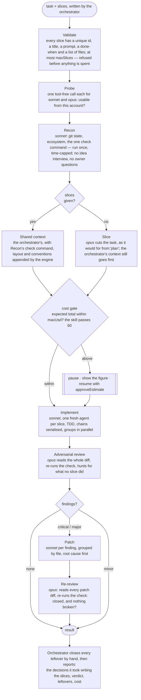

# verified-build

A Claude Code skill and the saved Workflow it drives: from an idea, a spec or a plan to
adversarially reviewed code, with the owner asked only the questions that are theirs
and told the cost before a line of code is written.

**Sonnet writes the spec; Opus attacks it and mends what held. The same for the
plan. Sonnet implements. Opus attacks the whole diff and re-runs the repo's check command.
Sonnet patches what matters. Opus re-attacks.** Nothing is called done because the model
that wrote it said so, and what the last pass leaves standing is closed by hand, at every
severity, before the result is reported.

Works on any git repo in any language: the first agent discovers from the repo itself what
"the checks pass" means, so the engine is never hand-tuned per project.

Two skills drive it, one section each below. `/verified-build` starts from an idea, a
spec or a plan and designs before it builds. `/verified-build-small` starts from slices
you have already written and runs only the code half: implement, review, patch,
re-review. Both share the engine, the layout, the install and the measurements that
shaped the defaults.

## /verified-build: from an idea to reviewed code

### How a run looks

```mermaid
flowchart TD
    I([idea · spec · plan]) --> PB[Probe<br/>one tool-free call per primary model: usable from this account?]
    PB --> R[Recon<br/><i>sonnet</i>: git state, ecosystem, the one check command — run once, time-capped — today's date; from an idea, where it lands and what the owner must decide first]
    R --> Q0{owner<br/>questions?}
    Q0 -- yes --> P0[[pause · ask the owner · resume with answers]]
    Q0 -- no --> S
    P0 --> S[Spec<br/><i>sonnet</i>: brainstorming doctrine, from recon's map and the owner's answers → docs/specs/…md, committed]
    S --> SR[Spec review<br/><i>opus</i> attacks with evidence, then edits and commits the spec with what survives re-verification]
    SR --> Q1{owner<br/>questions?}
    Q1 -- yes --> P1[[pause · ask the owner · resume with answers]]
    Q1 -- no --> P
    P1 --> P[Plan<br/><i>sonnet</i>: writing-plans doctrine → docs/plans/…md, committed]
    P --> PR[Plan review<br/><i>opus</i> opens every line range, compiles every block, greps every fixture — runs no tests — then edits and commits the plan]
    PR --> Q2{owner<br/>questions?}
    Q2 -- yes --> P2[[pause · ask · resume]]
    Q2 -- no --> SL
    P2 --> SL[Slice<br/><i>opus</i>: one task = one file-disjoint slice; the plan re-measured first if a fold-in or an answer moved its lines]
    SL --> C{cost gate<br/>USD at API list prices}
    C -- approve --> IM[Implement<br/><i>sonnet</i>, one fresh agent per slice, TDD, chains serialised, groups in parallel]
    C -- stop --> X([documents committed, no code])
    IM --> A[Adversarial review<br/><i>opus</i> reads the whole diff, re-runs the check, hunts for what no slice did]
    A --> F{findings?}
    F -- none --> DONE([result])
    F -- critical / major --> PT[Patch<br/><i>sonnet</i> per finding, grouped by file, root cause first]
    PT --> A2[Re-review<br/><i>opus</i>: reads every patch diff, re-runs the check: closed, and nothing broken?]
    A2 --> DONE
    F -- minor --> DONE
    DONE --> O[Orchestrator closes every leftover by hand, then reports:<br/>decisions first, verdict, leftovers, cost]
```



| Stage | Model | What it produces | Gate |
|---|---|---|---|
| Probe | every primary | one trivial answer per model the run will use | a model this account cannot use → stop, for cents |
| Recon | Sonnet | git state, ecosystem, the one check command (the fastest real one, run once under a time cap), today's date, the docs convention; from an idea, the files and line ranges it lands on and the owner's questions | not a repo, dirty tree or the trunk → stop; unanswered owner questions → **pause** |
| Spec | Sonnet¹ | `docs/specs/YYYY-MM-DD-<slug>.md`, committed, written from Recon's map with the owner's answers already recorded; small decisions recorded, big ones escalated | |
| Spec review | Opus¹ | findings with evidence; the same lane edits the spec to fold in what survives its re-verification, withdraws the rest with evidence, and commits — proved by the commit's `git show --stat` | no new commit listing the spec, even after one editor lane → stop; unanswered owner questions → **pause** |
| Plan | Sonnet¹ | `docs/plans/YYYY-MM-DD-<slug>.md`, committed; one task per future slice, real code, measured line ranges | |
| Plan review | Opus¹ | line ranges opened, code blocks compiled, fixtures and signatures grepped — no tests run, no worktree; then the fold-in, edited and committed into the plan and proved the same way | no new commit listing the plan, even after one editor lane → stop; unanswered owner questions → **pause** |
| Slice | Opus | one task = one slice, pointers not pastes, chains longer than four merged | |
| Cost gate | — | spent so far, ahead with a low–high band, total, at API list prices | **pause** until approved |
| Implement | Sonnet | one fresh agent per slice; a commit each | |
| Adversarial review | Opus | the whole diff read, the check re-run, the implementers' reports judged as claims; findings with a concrete failure scenario, or `clean:true` | a review that did not run the check is never clean |
| Patch (1 round) | Sonnet | critical and major findings only, grouped by file | |
| Re-review | Opus | every patch diff read, the check re-run: closed? and did the patches introduce anything? | |
| Orchestrator | you | closes every leftover at every severity by hand, then reports | |

¹ The four document stages, and the lane that records the owner's answers, are the one
part you may move per run: `docModels:better` puts the writers on Opus and the reviewers on
Fable. See "Use". Everything else is pinned.

Nothing is lost quietly. `ok` is mechanical: true only when every slice was implemented,
the adversary read the diff, ran the check and found nothing, no scope was left uncovered,
no implementer touched a file another slice had declared, and nothing was uncommitted at
review time — otherwise `not_ok` lists the reasons. A lane that returns nothing or throws
— primary and fallback alike — is recorded in `lane_errors`; a slice with no implementer
result is named in `not_implemented`; a document reviewer or answers author that
returns nothing, or a review whose findings never reach the file, stops the run before
any code is built; an adversary
that never returned makes the run `ok:false` with `review_missing:true` rather than
clean; and a finding whose patch failed or was disputed stays on the orchestrator's list,
while one reported fixed is closed only by the re-review's silence after it has read the
patch diff. Every result carries `timing`: the run's wall clock, agent-seconds per phase,
and one entry per lane, so the next tuning argument starts from a number. The turn's token
budget, where one is set, stops the run between phases with a partial report.

Four pauses, all of the same shape: the run returns early with `paused:true`, the
orchestrator asks the user, and the same run resumes with the answer. No prompt before a
pause mentions the answer, so every earlier agent replays from cache.

### Use

```
/verified-build <an idea, a paragraph, a failing test — or the path of a spec or a plan>
```

`from: idea | spec | plan` picks where the run starts; `idea` is the default. Read
`SKILL.md` for the pre-flight, the arguments, the four pauses and how to report a result
honestly: the decisions taken first, then the adversary's verdict, then the leftovers
closed by hand, then the cost. The skill is the opt-in that permits the Workflow tool.

### The default run: Sonnet designs, Opus judges

```
/verified-build Add a --since flag to the export command: ISO dates only, tested, docs updated.
```

which the orchestrator turns into

```js
Workflow({ name: 'build-verify-patch', args: {
  task: 'Add a --since flag to the export command: ISO dates only, tested, docs updated.',
} })
```

Sonnet writes the spec and the plan, Opus attacks each and folds in what survives, Sonnet
implements, Opus reviews the diff. This is the measured bargain: on a five-slice run the
document half is about USD 53 and the code half about USD 48, at API list prices.

### The same run with the design on stronger models

```
/verified-build docModels:better Add a --since flag to the export command: ISO dates only, tested, docs updated.
```

which becomes

```js
Workflow({ name: 'build-verify-patch', args: {
  task: 'Add a --since flag to the export command: ISO dates only, tested, docs updated.',
  docWriter: 'opus',   // the spec and plan writers
  docJudge: 'fable',   // both document reviewers, and the author that records the owner's answers
} })
```

Five lanes move — the two document writers, the two document reviewers, and the author
that records the owner's answers — and **nothing else**: Recon, the slicer, the
implementers, the patchers and the code adversary stay pinned where they are, because that
is where the token volume is. The document half roughly doubles, to about USD 106; the code
half does not change. The cost gate shows the real figure before a line of code is written,
and `estimate.breakdown` names the model per row.

Either knob takes `sonnet`, `opus` or `fable` on its own, so `docJudge:'fable'` alone
(a Sonnet writer, a Fable reviewer) is a run too. An alias the engine does not know is
refused in the run log and that lane keeps its default, rather than a typo quietly
deciding who reviewed your spec. Worth knowing: this is for runs where the **design** is
the risk — an unfamiliar domain, a migration whose shape you cannot picture. Where the
risk is in the code, the same money buys more as `maxRounds: 2`.

## /verified-build-small: you write the slices, it builds and attacks them

The second skill, for a change whose design is already done. The orchestrator has
investigated, can name the files and the observable end state, and writes the slices
itself; the same engine takes them as given (`from:'slices'`) and runs only the code
half. **No spec, no plan, no document review, no owner questions, no slicer.** What is
left is the part that was measured to matter most: Sonnet implements each slice in a
fresh agent, Opus attacks the whole diff and re-runs the check, Sonnet patches what
matters, Opus re-attacks, and the leftovers are closed by hand.

### How a small run looks



| Stage | Model | What it produces | Gate |
|---|---|---|---|
| Validate | — | the orchestrator's slices checked mechanically: unique ids, every text field a non-empty string, `files` a list of paths (empty means an unknown footprint, run alone), at most `maxSlices` | malformed → refused with the slice named, nothing spent |
| Probe | sonnet, opus | one trivial answer per pinned model | a model this account cannot use → stop, for cents |
| Recon | Sonnet | git state, ecosystem, the one check command (the fastest real one, run once under a time cap); no idea interview | not a repo, dirty tree or the trunk → stop |
| Slice | Opus | **only when `slices` is omitted**: the task cut into file-disjoint slices, as for `from:'plan'` | |
| Cost gate | — | the same estimate as the full run, minus the document rows; `plan.source` says who cut the slices | passes without pausing when the total is within `maxUsd` (the skill passes 60); above it, **pause** |
| Implement | Sonnet | one fresh agent per slice; a commit each; the shared context carries the orchestrator's notes and Recon's | |
| Adversarial review | Opus | the whole diff read, the check re-run, the implementers' reports judged as claims; findings with a concrete failure scenario, or `clean:true` | a review that did not run the check is never clean |
| Patch (1 round) | Sonnet | critical and major findings only, grouped by file | |
| Re-review | Opus | every patch diff read, the check re-run: closed? and did the patches introduce anything? | |
| Orchestrator | you | closes every leftover at every severity by hand, then reports; the decisions behind the build are the ones you took writing the slices, so say them | |

`ok` is the same mechanical verdict as the full run. The result has no documents block
(`documents.from` is `'slices'` and the rest is empty), `plan.source` is
`'orchestrator'` or `'slicer'`, and `plan.uncovered` can only be non-empty when the
slicer ran: scope the orchestrator left out of its own slices is the orchestrator's to
know.

### How to trigger it

```
/verified-build-small <the task, with the files and the end state you already know>
```

The orchestrator then does the work the full run's spec and plan lanes would have done,
in the session: greps the names the task mentions, opens the files, and writes one slice
per file-disjoint piece of work, each with a self-contained prompt and a complete list of
the files it will touch. It states the expected cost in the launch message and turns the
invocation into

```js
Workflow({ name: 'build-verify-patch', args: {
  from: 'slices',
  task: 'Add a --since flag to the export command: ISO dates only, tested, docs updated.',
  slices: [
    { id: 's1', title: 'parse --since', prompt: '…', files: ['src/cli.py', 'tests/test_cli.py'], done_when: '…' },
    { id: 's2', title: 'filter export rows', prompt: '…', files: ['src/export.py', 'tests/test_export.py'], done_when: '…' },
  ],
  sharedContext: '<where things live, what not to touch, the naming rule>',
  taskSummary: '<optional, at most ~250 words: the brief implementers get instead of task>',
  maxUsd: 60,
} })
```

`task` is the bar the adversary holds the work to, so every hard constraint goes there.
Implementers see the brief (`taskSummary`, or the full `task` without one), the shared
context and their own slice, nothing else; patchers see the brief only. Slices that
declare a common file run one after another, each in its own fresh agent; a file an
implementer touched outside its slice that another slice had declared is reported and
held against the run. The engine appends Recon's check command, layout notes and
conventions to `sharedContext`, so the orchestrator does not repeat those. Omit
`slices` and the Opus slicer cuts the task instead (one more lane, about USD 2); the
orchestrator's `sharedContext` and `taskSummary` are honoured on that path too, ahead
of the slicer's own. `slices`, `sharedContext` or `taskSummary` passed under another
`from` are ignored, and the run log says so.

**What it costs.** At API list prices from the engine's own profile: Recon about USD 2,
each implementer about USD 3, each Opus review pass about USD 12 (there are two), each
patched finding about USD 3. Three slices with one patch round come to about USD 40,
five to about USD 50; the two review passes dominate either way. The skill passes
`maxUsd:60`, so a run within that proceeds without a round trip and the orchestrator
says the figure at launch; above it, the run pauses at the cost gate exactly as the full
one does. Pass the user's own ceiling as `maxUsd` when they named one.

### Which one to reach for

| | `/verified-build` | `/verified-build-small` |
|---|---|---|
| you have | an idea, a paragraph, a failing test | the files, the change and the end state, already investigated |
| the risk is in | the design | the code |
| who decides the split | Sonnet writes the spec and plan, Opus attacks each, Opus slices | you, in the session; Opus slices only if you decline to |
| owner questions | Recon, the spec writer and the plan writer may pause to ask | none: there is no idea stage to raise them |
| cost gate | always pauses | passes within `maxUsd:60`, pauses above |
| at list prices, five slices | about USD 101 (USD 53 documents, USD 48 code) | about USD 50 |

Neither is for a one-line fix, and neither is for a user who wants to steer each step:
both run headless in the background.

## Layout

```
skills/verified-build/SKILL.md     the entry point: pre-flight, the arguments, the pauses, how to read a result
skills/verified-build-small/SKILL.md   the small entry point: you write the slices; no spec, no plan, no slicer
workflows/build-verify-patch.js    the engine: one deterministic Workflow script, plain JS, no dependencies — BUILT from src/, do not edit
src/NN-<part>.js                   the engine's source, one part per concern (knobs, lanes, schemas, doctrine, helpers, estimate, then a part per phase)
build.js                           assembles src/ into the engine (`node build.js`); `--check` says whether the committed engine is stale
install.sh                         checks the tools, runs check.sh, copies the pair into Claude config dirs (local or user@host:dir)
check.sh                           build check, syntax check of the engine, then the tests
test/helpers.test.js               the pure helpers (path overlap, grouping, prices, the review verdict, timing, the orchestrator's list) in isolation
test/engine.test.js                the whole engine run against a stubbed runtime: every pause, gate and failure path
CHANGELOG.md                       what changed, by version
```

CI runs `./check.sh` on every push (`.gitlab-ci.yml`, and `.github/workflows/check.yml`
on the mirror).

The three files are a pair and travel together. The names differ on purpose: an
identically-named workflow would shadow a skill in the registry and skip its pre-flight.

## Install

```
./install.sh                                   # $CLAUDE_CONFIG_DIR or ~/.claude
./install.sh ~/.claude-work ~/.claude-personal  # several profiles
./install.sh cloud:~/.claude-stonks             # a remote box, via scp
```

`install.sh` copies both skills and the engine — three files, three checksums. Then
restart the Claude Code session that will use it (skills are read at session start;
a resident session on a server is restarted the same way). Every copy should be
byte-identical; `install.sh` prints the checksums so you can see it.

**What a box needs.** `git` — every lane of a run commits and diffs. `ssh` and `scp` for a
remote install target. `node` (18 or later) only for `check.sh`, which `install.sh` runs
before copying anything so a broken engine is never installed (`--no-check` skips it on a
box without node). No plugin, no package. On an API-key account, the models the engine
pins — `sonnet` and `opus`, plus `fable` if you raise the document tiers or a lane falls
back — must be enabled for the organisation; the engine's first phase probes every primary
for cents and stops with `stage:'probe'` if one is not.

## What it costs and where the time goes

Two measurements shaped the defaults.

**Six runs of the back half** on one Python repo (9–11 Sep 2026, plans of 5 to 12 tasks):
25 hours of wall clock, about 2.3 billion cached-read tokens, 30 to 60 agents a run,
roughly USD 75 to 250 a run at API list prices. The patch rounds were 46% of the time and
51% of the tokens and the source of most patch-introduced defects; that is why the defaults
are one round, critical and major findings only, and the leftovers closed by hand.

**One full run, front half included** (11 Sep 2026: five slices, one owner question, one
patch round), reconstructed from its 29 agent transcripts: 223 minutes wall clock, 73 of
them waiting for the owner, 150 with agents active — and 92 of those 150 in the front half.

| Phase | Minutes | Since |
|---|---|---|
| Recon | 7.4 (half of it babysitting the full test suite) | v1.4.0: one check, once, time-capped |
| Spec, spec review, fold-in | 9.4, 8.4, 9.3 | v1.4.0: review and fold-in are one lane; v1.5.0: the writer on Sonnet; v1.6.0: the writer starts from Recon's map with the owner's answers in hand, and no answers lane runs for them |
| Plan, plan review, fold-in | 16.8, 22.4 (tasks spliced into a worktree), 7.1 | v1.4.0: reads and compiles, runs no tests; one lane; v1.5.0: the writer on Sonnet |
| Decision record, plan index | 5.8, 0.4 | v1.4.0: the recorder is gone |
| Slice | 2.2 | |
| Implement | 12.7 | |
| Verify | 16.1, for 0 of 5 slices failed | v1.3.0: gone; the adversary runs the check |
| Adversary, patch, patch verifiers, re-review | 7.6, 3.5, 6.9, 11.4 | v1.3.0: patch verifiers gone |

Expected on that run after both versions: about 60 minutes of front half and 35 of back
half. The full record is in `SKILL.md` under "Tuned from six runs" and in `CHANGELOG.md`;
the cost gate's profile is the engine's `PROFILE` table, whose front-half rows are still
marked as assumptions until refined from a run's `timing` and transcripts.

## What a run executes, and where

Every agent works in **the session's checkout**, on the branch checked out there, with the
tools the session has. Recon finds the repo's check commands — CI config, Makefile,
package scripts — and runs exactly one of them, the fastest real one, once, under a
three-minute cap, before naming it the check every later lane runs; so launching on a
freshly cloned repo runs that repo's own scripts on your machine, as any test runner
would. The repo's `CLAUDE.md`
and `AGENTS.md` are quoted into every prompt as binding conventions. Launch only on repos
whose scripts and instructions you would run by hand.

**Known limits.** The tree is shared: implementers (and patchers) in different groups run
at once in one checkout, up to `wave` of them. Implementers commit by pathspec (`git commit --
<files>`) and never sweep, a slice with no declared files runs with nothing else live, and
a file touched inside another slice's footprint is reported and held against the run — but
a check command that cannot tolerate two concurrent runs (one dev database, one fixed temp
path) can fail spuriously; pass a `testCmd` that can, or expect a re-run. The adversary runs
the check on the tree as it stands after the implement phase, not checked out per commit;
there is no per-slice verifier (see the changelog for v1.3.0). The
runtime's worktree isolation is not used because each slice's commits would land on a
different worktree. Recon runs the check command before any gate; launch only on repos
whose scripts you would run by hand. The front half (spec, plan, their reviews) has been
measured in one full live run, by hand from the transcripts; its token-profile rows in the
cost estimate are still labelled as assumptions.

## Doctrine

The stages carry the doctrine of the [superpowers](https://github.com/obra/superpowers)
skills by Jesse Vincent (MIT): brainstorming for the spec writer, writing-plans for the
plan writer, the spec and plan reviewer templates, receiving-code-review for the reviewers'
fold-in half, test-driven-development and verification-before-completion for implementers,
systematic-debugging for patchers, and the code-reviewer calibration for every judge. They
are copied into the engine so an install without the plugin behaves identically. Only the
interactive parts were adapted: there is no approval gate inside a run, and "ask your
partner" became "decide and record, or escalate to the owner".

## Licence

MIT — see `LICENSE.md`. The embedded doctrine keeps its own MIT notice there.
